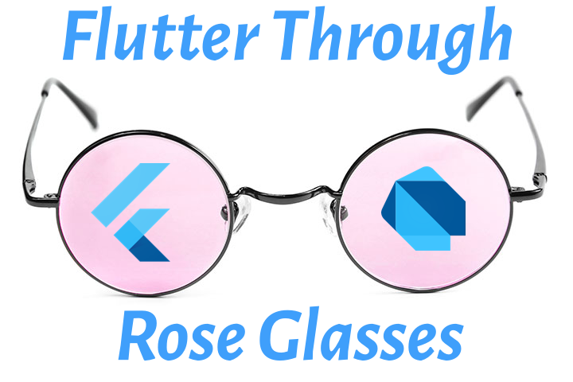

# Flutter Rose Glasses

This is the companion repo to my Medium Articles and the upcoming Flutter Application Development and Design book titled, Flutter Through Rose Glasses.

Code curated here is under the BSD-2-clause license while my Medium.com articles are under my own commercial copyright and the upcoming book is and will be under my commercial copyright.

Code is curated here via git-submodules and is updated frequently.

## Keep Track

To keep track of my additions is easy just join GitHub:

[Join GitHub](https://github.com/join)

Then click the watch button on this project and my project updates will show up in your GitHub user screen that you first encounter when you goto github.com and are logged-in.

## Medium Articles

Grouping my medium articles into these groups of categories:

### Devops

[An Architecture Layout](https://medium.com/p/an-architecture-layout-8f414271b2b4)

### Cross Platform User Interface

### Testing

### Animation

### Canvas

### Object-Oriented-Programming

### Functional-Programming

### User Interface Design

## Repos

Grouping the repos here, listed by name and function:

### fapp_template

This is the standard flutter app template that the IDEs and the flutter sdk output when you create a project. The problem is that it's filled with bad-habits and wrong practices to follow. DO NOT EVER BUILD YOUR FLUTtER APP using those bad-habits. Instead, see my other repos and my articles and books so that you can reach flutter expert level in 1000 hours instead.

### fproject_layout

This is my general project setup that setups my project workflow automation stuff, a proper project readme, a suggestion architecture layout for the lib source folder, etc.

### flogging

This repo demos how to implement a complete logging strategy to turn all uncaught exceptions into caught exceptions by end of app development.

### fcatching

The code source shows how to use the Catcher-plugin to catch app-errors by logging app-exceptions to a 3rd-party services.

## Code Licence

BSD-claus-2 license.
